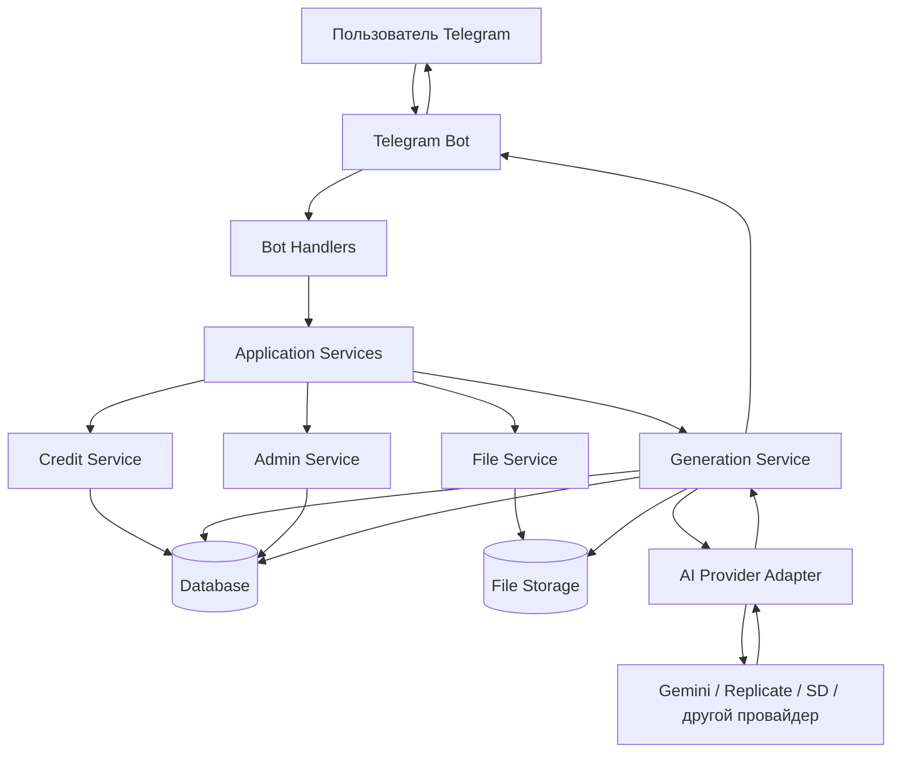

# Docs

В этой папке хранится документация проекта: описание архитектуры, инструкции по запуску, заметки по разработке и другие материалы для команды.

## Архитектура

```mermaid
flowchart TD
    U[Пользователь Telegram] --> B[Telegram Bot]

    B --> H[Bot Handlers]
    H --> S[Application Services]

    S --> C[Credit Service]
    S --> G[Generation Service]
    S --> A[Admin Service]
    S --> F[File Service]

    C --> DB[(Database)]
    G --> DB
    A --> DB
    F --> FS[(File Storage)]

    G --> AI[AI Provider Adapter]
    AI --> P[Gemini / Replicate / SD / другой провайдер]

    P --> AI
    AI --> G
    G --> FS
    G --> DB
    G --> B
    B --> U
```
